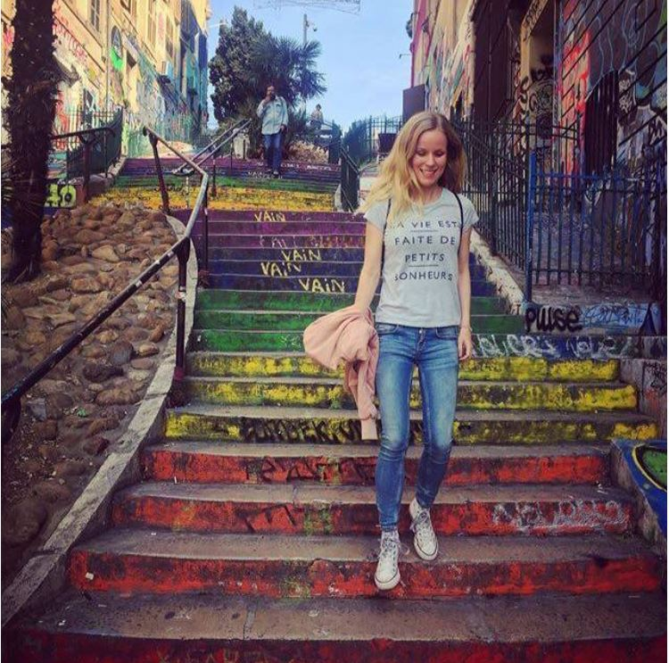

## Introduction

 I am a master's student of University of Helsinki. I graduated as Bachelor of Arts in November 2019 having my major in Portuguese Philology. As minors I have studied Spanish Philology and Computer Science. Now focusing on Language Technology.

## Find me on

[Instagram](https://www.instagram.com/jonsqui/?hl=fi), [GitHub](https://github.com/J0nna)

## Contact

My email address is of the form first_name.last_name@helsinki.fi. 

## Courses I've Taken

[Introduction to Language Technology](https://courses.helsinki.fi/fi/kik-405/130355898), fall 2018

[Korpuslingvistiikka ja tilastolliset menetelmät](https://courses.helsinki.fi/fi/kik-404/130365670), fall 2018

[Programming for Linguists](https://courses.helsinki.fi/fi/kik-lg208/130394640), spring 2019

[Commandline Tools for Linguists](https://courses.helsinki.fi/fi/kik-lg219/129824412), fall 2019

## Projects

[My first project on Github](https://github.com/J0nna/cmdline-course)

This project was part of the course "Command line tools for linguists". It's about learning to use Github and understanding the importance of version control.

## CV

Find my CV [here](https://www.overleaf.com/read/fbhddbnxcmkz).

## Misc. 

If you are visiting Helsinki, the best views are from [Sky Room](https://www.nordicchoicehotels.com/hotels/finland/helsinki/clarion-hotel-helsinki/our-facilities/sky-room/). Enjoy! 